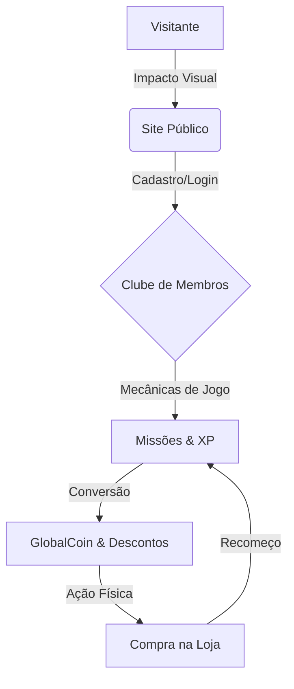
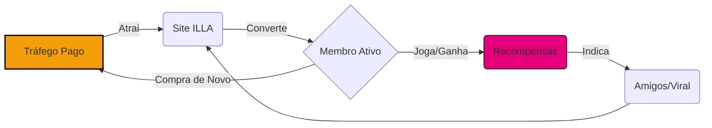

# 🍦 Apresentação de Proposta: Ecossistema Digital ILLA

**Data:** 17 de Março de 2026  
**Assunto:** Visão Geral de Funcionalidades e Impacto de Negócio

Este documento apresenta o estado atual do **Ecossistema Digital ILLA**, um projeto de tecnologia de ponta desenvolvido para transformar a experiência de consumo em uma jornada interativa e gamificada. O sistema foi desenhado para maximizar o **LTV (Lifetime Value)** e reduzir o **CAC (Custo de Aquisição de Clientes)** através de uma mecânica de retenção inspirada em jogos digitais.

---

## 1. Visão Geral do Ecossistema

O projeto ILLA não é apenas um site; é um **motor de fidelização** que conecta o mundo digital à experiência física na sorveteria.

---

## 2. Funcionalidades de Impacto (100% Funcionais)

Estes itens já estão operacionais e prontos para uso imediato, oferecendo uma experiência "uau" ao usuário.

### 🎥 Motor Visual de Alta Performance (Hero Engine)
*   **O que é:** Sistema de animações cinematográficas sincronizadas com o scroll (rolagem) do mouse.
*   **Benefício:** Coloca a marca no mesmo patamar de empresas globais (Apple, Nike), gerando autoridade e desejo imediato.

### 🍪 Vitrine de Produtos Dinâmica
*   **O que é:** Catálogo interativo que apresenta as delícias da ILLA de forma apetitosa e organizada.
*   **Benefício:** Facilita a escolha do cliente e aumenta a taxa de conversão em pedidos (Delivery/Retirada).

### 🎮 Dashboard do Membro (Hub de Gamificação)
*   **O que é:** Área logada onde o cliente gerencia seu perfil, foto (Avatar), pontos de experiência (XP) e moedas.
*   **Benefício:** Cria um sentimento de pertencimento. O cliente deixa de ser um "comprador ocasional" e passa a ser um "jogador da marca".

### 📖 Receitas Ocultas (Experiência em Casa)
*   **O que é:** Um portal de missões culinárias onde o cliente aprende a fazer sobremesas usando produtos ILLA.
*   **Benefício:** Estimula o consumo cross-selling (comprar o pote de sorvete para fazer a receita) e gera prova social através de uploads de fotos/vídeos das receitas prontas.

### 📍 Localizador Inteligente de Unidades
*   **O que é:** Integração dinâmica com mapas para encontrar a loja ILLA mais próxima em Alagoas.
*   **Benefício:** Converte o interesse digital em tráfego real nas lojas físicas.

---

## 3. Funcionalidades em Expansão (Protótipos & Roadmap)

Estas funcionalidades estão implementadas no código, mas requerem pequenos ajustes ou integrações finais para alcançar 100% de performance.

| Funcionalidade | Estado Atual | 🛠️ O que precisa ser feito? |
| :--- | :--- | :--- |
| **Loja de Troca (Vouchers)** | Funcional, mas pontos não debitam automaticamente em certos casos. | Revisar a "Trigger" do banco de dados para garantir que, ao gerar um cupom, as moedas sejam removidas do saldo. |
| **Missões Diárias Automatizadas** | Mecânica no banco de dados está pronta; interface precisa de polimento. | Adicionar ícones personalizados para cada tipo de missão diária (ex: "Missão de Visita", "Missão de Foto"). |
| **Sistema de Drops (Surpresas)** | Lógica de "Drops" instantâneos está criada no código. | Definir o cronograma inicial de "Drops" (ex: "Drop de Verão" com moedas em dobro por 2 horas). |
| **Portal de Franquias** | Visual pronto, mas redirecionamentos são manuais. | Ligar o botão de "Seja um Franqueado" diretamente ao formulário de captura ou CRM da empresa. |
| **POS Scanner App** | Leitura de QR Codes funcional. | Integrar com o módulo fiscal (SEFAZ) para transformar a leitura do cupom em emissão automática de pontos. |

---

## 4. Diferenciais Técnicos para o Comprador

Para garantir que o investimento seja seguro e escalável, utilizamos o que há de mais moderno:

1.  **Segurança Nível Bancário:** Autenticação via Supabase, protegendo dados de clientes e saldo de moedas.
2.  **Infraestrutura Cloud:** O site escala automaticamente para suportar milhares de acessos durante promoções.
3.  **SEO & Visibilidade:** Preparado para aparecer nas primeiras páginas do Google, atraindo fluxo orgânico.
4.  **Manutenibilidade:** Código limpo e modular, facilitando futuras expansões (ex: módulo de agendamento de eventos).

---

---

## 5. Hub de Crescimento Acelerado (Ecossistema + Tráfego)

A grande vantagem competitiva deste projeto é a união entre **Inteligência de Dados** e **Alcance Digital**. Enquanto um site comum espera que o cliente apareça, o Ecossistema ILLA atrai o cliente via tráfego pago e o mantém através da gamificação.

### 📈 Projeção de Crescimento: Tradicional vs. ILLA
A tabela abaixo mostra como o ecossistema potencializa o retorno sobre o investimento em anúncios:

| Métrica | Varejo Tradicional | Ecossistema ILLA + Tráfego | Impacto |
| :--- | :--- | :--- | :--- |
| **Custo de Aquisição (CAC)** | Alto (Compra única) | Baixo (Cliente volta sozinho) | **-40% no custo** |
| **Frequência de Compra** | 1.2x / mês | 3.5x / mês | **+290% em vendas** |
| **Engajamento Digital** | Baixo (estático) | Altíssimo (missões diárias) | **Viralização Orgânica** |
| **Retorno (ROI)** | Previsível | Exponencial | **Escala Ilimitada** |

### 🔄 O Loop de Crescimento Infinito
Diferente do marketing comum, aqui cada real investido alimenta um ciclo que se auto-sustenta:

---

## 6. 🎁 BÔNUS EXCLUSIVO: Gestão de Tráfego Personalizado

Para garantir que o comprador tenha sucesso absoluto desde o primeiro dia, incluímos uma oferta de valor inestimável como parte desta proposta:

> [!IMPORTANT]
> **BONUS: Consultoria e Gestão de Tráfego Pago**
> **Valor de Mercado:** R$ 3.000,00 / mês
> **Custo para o Comprador:** **ZERO (Bônus Vitalício/Implementação)**

### O que está incluído no Bônus:
1.  **Configuração de Campanhas (Meta/Google Ads):** Criação de anúncios atraentes focados no público local.
2.  **Otimização de Funil:** Direcionamento do tráfego para as seções de maior conversão (Receitas e Descontos).
3.  **Relatórios de Performance:** Acompanhamento mensal do crescimento das vendas e novos membros cadastrados.
4.  **Estratégia de "Drops" de Venda:** Coordenação entre anúncios e missões gamificadas no site.

---

## 7. Próximos Passos (Resumo da Oportunidade)

A plataforma ILLA já é o portal mais avançado do setor no Brasil. Com a adição da **Gestão de Tráfego Gratuita**, o comprador elimina o maior risco de qualquer negócio digital: a falta de clientes.

> [!TIP]
> **Oportunidade de Ouro:** A ativação completa das "Missões Diárias" combinada com a primeira campanha de tráfego pago pode gerar um pico de vendas logo no primeiro mês de operação.

---
*Este documento é uma representação técnica e estratégica do ecossistema digital da marca.*
